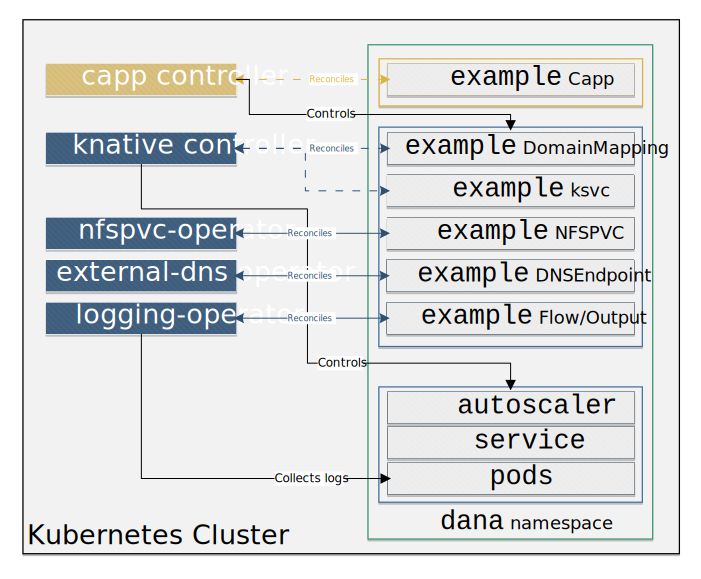

# container-app-operator

The `container-app-operator` is an operator that reconciles `Capp` CRs.

`Capp` (or ContainerApp) provides a higher-level abstraction for deploying containerized workload, making it easier for end-users to deploy workloads on Kubernetes without being knowledgeable in Kubernetes concepts, while adhering to the standards required by the infrastructure and platform teams without any extra burden on the users.

The operator uses open-source projects, such as [`Knative Serving`](https://github.com/knative/serving) and [`logging-operator`](https://github.com/kube-logging/logging-operator) to create an abstraction for containerized workloads.

## Run Container Service

The `container-app-operator` project can work as a standalone solution, but is mostly used together with the [`rcs-ocm-deployer` project](https://github.com/dana-team/rcs-ocm-deployer), which allows deploying `Capp` workloads in a multi-cluster set-up, using the `OCM` (Open Cluster Management) open-source project.

## High Level Architecture



1. The `capp controller` reconciles the `Capp` CRs in the cluster and creates (if needed) a `Knative Service` (`ksvc`) CR, a `DommainMapping` CR, and `Flow` & `Output` CRs for every Capp.

2. The `knative controller` reconciles the `ksvc` CRs in the cluster and controls the lifecycle an autoscaler and pods relevant to the `ksvc`.

3. The `logging-operator controller` reconciles the `Flow` and `Output` CRs in the cluster and collects logs from the pods' `stdout` and sends them to a pre-existing `Elasticsearch` or `Splunk` index.

## Feature Highlights

- [x] Support for autoscaler (`HPA` or `KPA`) according to the chosen `scaleMetric` (`concurrency`, `rps`, `cpu`, `memory`) with default settings.
- [x] Support for HTTP/HTTPS `DomainMapping` for accessing applications via `Ingress`/`Route`.
- [x] Support for all `Knative Serving` configurations.
- [x] Support for exporting logs to `Elasticsearch` and `Splunk` indexes.
- [x] Support for changing the state of `Capp` from `enabled` (workload is in running state) to `disabled` (workload is not in running state).

## Getting Started

### Prerequisites

1. A Kubernetes cluster (you can [use KinD](https://kind.sigs.k8s.io/docs/user/quick-start/)).

2. `Knative Serving` installed on the cluster (you can [use the quickstart](https://knative.dev/docs/getting-started/quickstart-install/))

3. `Logging Operator` installed on the cluster (you can [use the Helm Chart](https://kube-logging.dev/docs/install/#deploy-logging-operator-with-helm))

`Knative Serving` and `Logging Operator` can also be installed by running:
```bash
$ make prereq
```

### Deploying the controller

```bash
$ make deploy IMG=ghcr.io/dana-team/container-app-operator:<release>
```

#### Build your own image

```bash
$ make docker-build docker-push IMG=<registry>/container-app-operator:<tag>
```

### Change target autoscaler default values
To change the target values a `configMap` with the name `autoscale-default` in the namespace `capp-operator-system` needs to be created.

The `configMap` should contain the scale metric types as keys and for the value the desired target values.

The `configMap` will affect the `ksvc` autoscale target value annotation `autoscaling.knative.dev/target`.

#### Example

```yaml
kind: ConfigMap
apiVersion: v1
metadata:
  name: autoscale-defaults
  namespace: capp-operator-system
data:
  rps: "200"
  cpu: "80"
  memory: "70"
  concurrency: "10"
```

## Example Capp

```yaml
apiVersion: rcs.dana.io/v1alpha1
kind: Capp
metadata:
  name: capp-sample
  namespace: capp-sample
spec:
  configurationSpec:
    template:
      spec:
        containers:
          - env:
              - name: APP_NAME
                value: capp-env-var
            image: 'quay.io/danateamorg/example-python-app:v1-flask'
            name: capp-sample
  routeSpec:
    hostname: capp.dev
    tlsEnabled: true
    tlsSecret: cappTlsSecretName
  logSpec:
    type: elastic
    host: 10.11.12.13
    index: main
    username: elastic
    passwordSecretName: es-elastic-user
    sslVerify: false
  scaleMetric: concurrency
  state: enabled
```
