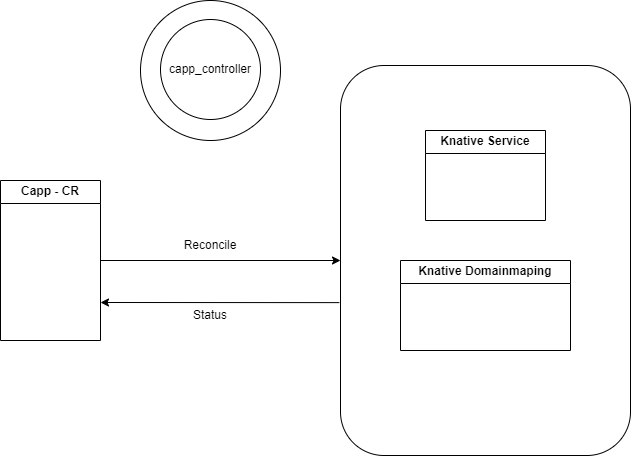

## What is RCS?
RCS is an open-source implementation of Container-as-a-Service. It utilizes [Knative](https://github.com/knative). and [OCM](https://github.com/open-cluster-management-io) to create and manage workloads across multiple clusters, providing cloud-like features and technologies to offline environment users. RCS offers an auto cluster schedule based on cluster usage and availability, requires low configuration, and provides an auto-scaler template based on a single metric. With RCS, users can manage multiple revisions and custom DNS names, among other features. Overall, RCS aims to simplify and streamline the management of containerized applications, making it easier for developers to focus on writing code.

## What is Knative?
Knative is an open-source project used by RCS to build, deploy, and manage serverless workloads across multiple clusters. It provides a platform-agnostic solution for running serverless deployments, allowing RCS users to manage workloads with ease.


## Description

### How does it work ?

The `CappReconciler` takes `Capp` resource created by the `ManifestWork` agent on the managed cluster and "Translate" it to knative objects such as `Knative service`, `Knative Domainmapping` with configured `AutoScale` and `TLS` options.





### Running on the cluster
1. Install Instances of Custom Resources:

```sh
kubectl apply -f config/samples/
```

2. Build and push your image to the location specified by `IMG`:
	
```sh
make docker-build docker-push IMG=<some-registry>/capp-operaor:tag
```
	
3. Deploy the controller to the cluster with the image specified by `IMG`:

```sh
make deploy IMG=<some-registry>/capp-operaor:tag
```

### Uninstall CRDs
To delete the CRDs from the cluster:

```sh
make uninstall
```

### Undeploy controller
UnDeploy the controller to the cluster:

```sh
make undeploy
```

### Modifying the API definitions
If you are editing the API definitions, generate the manifests such as CRs or CRDs using:

```sh
make manifests
```

**NOTE:** Run `make --help` for more information on all potential `make` targets

More information can be found via the [Kubebuilder Documentation](https://book.kubebuilder.io/introduction.html)

## License

Copyright 2023.

Licensed under the Apache License, Version 2.0 (the "License");
you may not use this file except in compliance with the License.
You may obtain a copy of the License at

    http://www.apache.org/licenses/LICENSE-2.0

Unless required by applicable law or agreed to in writing, software
distributed under the License is distributed on an "AS IS" BASIS,
WITHOUT WARRANTIES OR CONDITIONS OF ANY KIND, either express or implied.
See the License for the specific language governing permissions and
limitations under the License.

